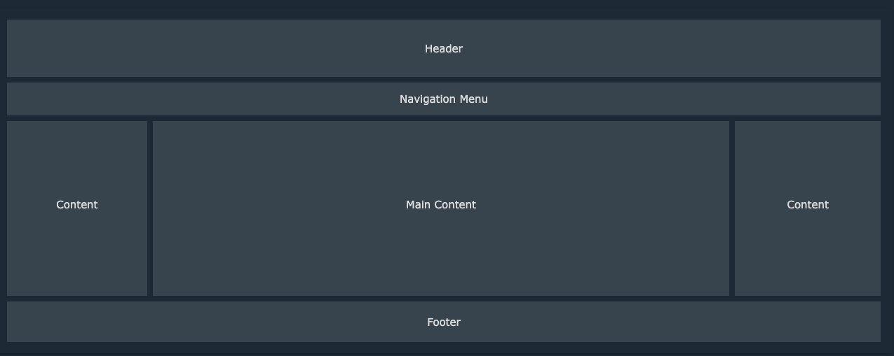

# HTML

## What is HTML?

- **HTML** stands for **Hyper Text Markup Language**.
- It is the standard **markup language** used for creating **Web pages**.
- HTML **describes the structure** of a Web page.
- It consists of a **series of elements**.
- HTML elements **tell the browser** how to display the content.
- These elements **label pieces of content** such as "this is a heading", "this
  is a paragraph", "this is a link", etc.



## HTML Structure

```html
<!DOCTYPE html>
<html>
  <head>
    <!-- Metadata and links to external resources -->
    <link rel="icon" href="http://example.com/favicon.png" />
    <title>Page Title</title>
  </head>
  <body>
    <header>
      <h1>My First Heading</h1>
    </header>
    <main>
      <p>My first paragraph.</p>
    </main>
  </body>
</html>
```

- The `<!DOCTYPE html>` declaration defines the document type as HTML5.
- The `<html>` element is the root element of an HTML page.
- The `<head>` element contains metadata about the HTML document.
- The `<title>` element specifies the title for the HTML page (shown in the
  browser's title bar or tab).
- The `<body>` element defines the document's body, containing all the visible
  content such as headings, paragraphs, images, links, etc.

## HTML Elements

An HTML element is defined by an opening `<tag>`, content, and a closing
`</tag>`. Some HTML elements, like `<br>`, are empty and do not have closing
tags.

## Headings

Headings are defined with the `<h1>` to `<h6>` tags, `<h1>` being the highest
(or most important) level and `<h6>` the lowest.

```html
<h1>This is heading 1</h1>
<h2>This is heading 2</h2>
<h3>This is heading 3</h3>
<h4>This is heading 4</h5>
<h5>This is heading 5</h5>
<h6>This is heading 6</h6>
```

## Paragraphs

Paragraphs are defined with the `<p>` tag.

```html
<p>This is a paragraph</p>
```

## Links

Links are defined with the `<a>` tag, which stands for "anchor". The `href`
attribute specifies the URL of the page the link goes to.

```html
<a href="https://hackyourfuture.be/">This is a link</a>
```

## Images

Images are defined with the `` tag. The `src` attribute specifies the path
to the image, and the `alt` attribute provides alternative text for the image.

```html

```

## Attributes

Attributes provide additional information about HTML elements. They are always
included in the opening tag and usually come in name/value pairs like
`name="value"`.

## Formatting Elements

HTML provides several tags for text formatting:

- `<b>` - Bold text
- `<strong>` - Important text
- `<i>` - Italic text
- `<em>` - Emphasized text
- `<mark>` - Marked text
- `<small>` - Smaller text
- `<del>` - Deleted text
- `<ins>` - Inserted text
- `<sub>` - Subscript text
- `<sup>` - Superscript text

## Tables

Tables are used to display tabular data and are defined with the `<table>` tag.
Inside the table, the data is structured with `<tr>` (table rows), `<th>` (table
headers), and `<td>` (table data cells).

```html
<table>
  <tr>
    <th>Company</th>
    <th>Contact</th>
    <th>Country</th>
  </tr>
  <tr>
    <td>Alfreds Futterkiste</td>
    <td>Maria Anders</td>
    <td>Germany</td>
  </tr>
  <tr>
    <td>Centro comercial Moctezuma</td>
    <td>Francisco Chang</td>
    <td>Mexico</td>
  </tr>
</table>
```

## Lists

HTML supports ordered (`<ol>`) and unordered (`<ul>`) lists.

### Unordered List

```html
<ul>
  <li>Coffee</li>
  <li>Tea</li>
  <li>Milk</li>
</ul>
```

### Ordered List

```html
<ol>
  <li>Coffee</li>
  <li>Tea</li>
  <li>Milk</li>
</ol>
```

## Block and Inline Elements

### Block-level Elements

A block-level element always starts on a new line and stretches out to the left
and right as far as it can. Examples include `<div>`, `<h1>`, `<p>`, and
`<table>`.

### Inline Elements

An inline element does not start on a new line and only takes up as much width
as necessary. Examples include `<span>`, `<a>`, and ``.

```html
<p>Hello World</p>
<div>Hello World</div>
<span>Hello World</span>
```

## Iframe

An iframe is used to embed another document within the current HTML document.

```html
<iframe
  src="demo_iframe.htm"
  height="200"
  width="300"
  title="Iframe Example"
></iframe>
```

## Responsive Web Design

Responsive web design allows a web page to adapt to different screen sizes and
viewports.

```html
<meta name="viewport" content="width=device-width, initial-scale=1.0" />
```

## Semantic Elements

Semantic elements clearly describe their meaning in a human- and
machine-readable way.

### Examples of Non-semantic Elements

- `<div>` and `<span>` do not convey any information about their content.

### Examples of Semantic Elements

- `<form>`, `<table>`, and `<article>` clearly define their content.

## Absolute Path vs Relative Path

### Absolute Path

```html

```

### Relative Path

```html

```

## Entities

HTML entities are used to display reserved characters.

```html
<!-- copyright -->
<div>&#169;</div>
```

## Symbols

HTML supports various symbols.

```html
<!-- euro -->
<div>&euro;</div>
```

## Emojis

HTML supports emojis through entities.

```html
<!-- smiley face -->
<div>&#128512;</div>
```

## Forms

Forms are used to collect user input. Various types of inputs are available,
such as text, radio buttons, and checkboxes.

```html
<form>
  <label for="firstName">First name:</label><br />
  <input type="text" id="firstName" name="firstName" /><br />
  <label for="lastName">Last name:</label><br />
  <input type="text" id="lastName" name="lastName" />
</form>
```

### Various Input Types

```html
<!-- 
<input type="button" />
<input type="checkbox" />
<input type="color" />
<input type="date" />
<input type="email" />
<input type="file" />
<input type="hidden" />
<input type="image" />
<input type="month" />
<input type="number" />
<input type="password" />
<input type="radio" />
<input type="range" />
<input type="reset" />
<input type="search" />
<input type="submit" />
<input type="tel" />
<input type="text" />
<input type="time" />
<input type="url" />
<input type="week" /> 
-->
```

## Videos and Audio

HTML supports embedding media such as videos and audio.

### Video Example

```html
<video width="320" height="240" controls>
  <source src="movie.mp4" type="video/mp4" />
</video>
```

### Audio Example

```html
<audio controls>
  <source src="horse.mp3" type="audio/mpeg" />
</audio>
```
